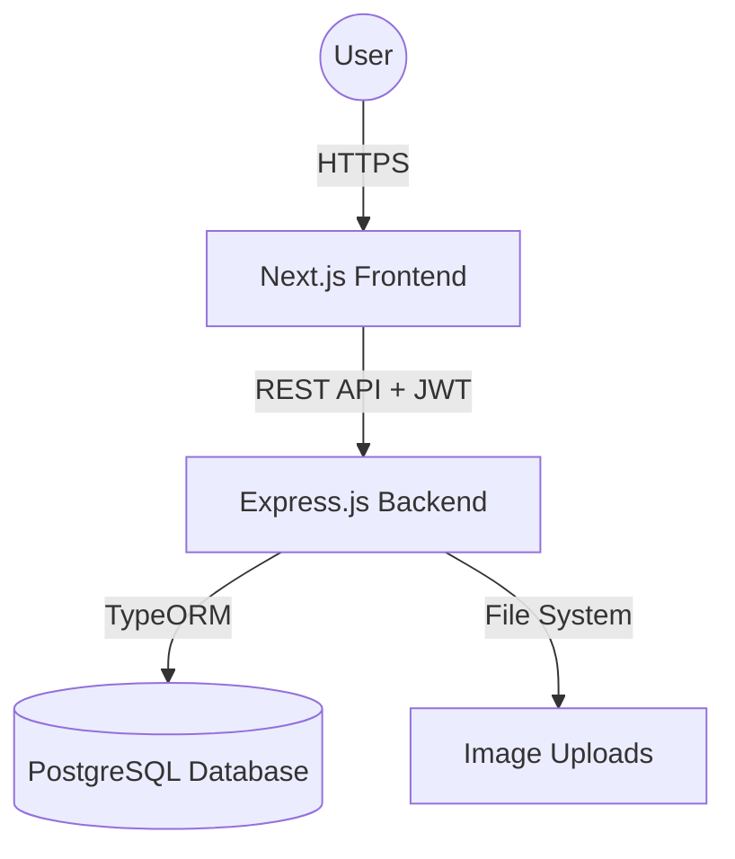
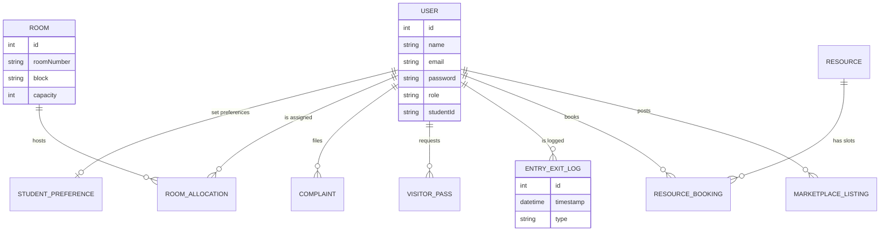
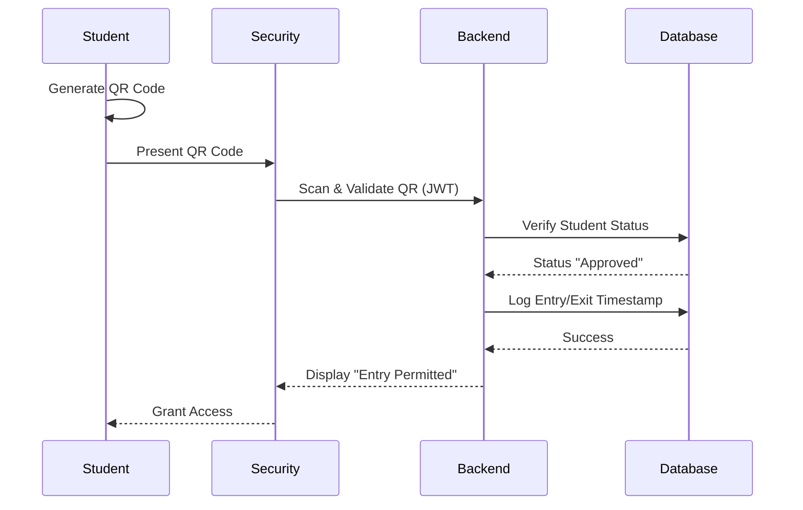

# Software Requirements Specification (SRS)
## Project: Smart Hostel Management System

**Version**: 1.0  
**Date**: April 4, 2026  
**Status**: Final Release  

---

## 1. Introduction

### 1.1 Purpose
The purpose of this document is to provide a detailed overview of the "Smart Hostel Management System," its requirements, architecture, and core functionalities. This document is intended for project stakeholders, developers, and academic evaluators.

### 1.2 Project Scope
The Smart Hostel Management System is a full-stack web application designed to automate traditional hostel workflows. It covers student registration, room allocation, entry/exit logging via QR codes, resource booking (Gym/Laundry), mess management, and a community marketplace.

### 1.3 Definitions, Acronyms, and Abbreviations
- **SRS**: Software Requirements Specification
- **ERD**: Entity Relationship Diagram
- **JWT**: JSON Web Token (Authentication)
- **API**: Application Programming Interface
- **RBAC**: Role-Based Access Control

---

## 2. Overall Description

### 2.1 Product Perspective
The system is built using a modern decoupled architecture, where the frontend communicates with the backend via a RESTful API.

#### System Architecture Diagram


### 2.2 User Classes and Characteristics
1.  **Student**: General residents who book resources, request passes, and generate QR codes.
2.  **Warden / Admin**: Administrative users who manage rooms and student approvals.
3.  **Security Guard**: Users responsible for scanning QR codes and logging entry/exit.
4.  **Super Admin**: High-level system administrator for user management.

---

## 3. Functional Requirements

### 3.1 Use Case Diagram
```mermaid
useCaseDiagram
    actor "Student" as S
    actor "Warden" as W
    actor "Security" as G
    actor "Super Admin" as SA

    S --> (Generate QR)
    S --> (Book Gym/Laundry)
    S --> (Report Complaint)
    S --> (Request Visitor Pass)
    
    W --> (Approve Registration)
    W --> (Allocate Room)
    W --> (Broadcast Emergency)
    W --> (Manage Mess Menu)
    
    G --> (Scan Student QR)
    G --> (Log Entry/Exit)
    G --> (Verify Visitor Pass)
    
    SA --> (Manage All Users)
    SA --> (System Audit)
```

---

## 4. Data Requirements

### 4.1 Entity Relationship Diagram (ERD)


---

## 5. Behavioral Models

### 5.1 Sequence Diagram: Student Entry/Exit Process


---

## 6. External Interface Requirements

### 6.1 User Interfaces
- **Responsive Web Design**: Dark-themed glassmorphism UI using Tailwind CSS.
- **Role-specific Dashboards**: Custom views for Students, Wardens, and Security.

### 6.2 Software Interfaces
- **Database**: PostgreSQL (Relational DB)
- **Framework**: Next.js (Frontend SSR/ISR)
- **Runtime**: Node.js (Backend)

---

## 7. Non-functional Requirements

### 7.1 Security
- **Authentication**: JWT-based stateless authentication.
- **Authorization**: Role-Based Access Control (RBAC) enforced via backend middleware.
- **Password Hashing**: Bcryptjs for secure credential storage.

### 7.2 Performance
- **Low Latency**: Optimized database queries with TypeORM.
- **Scalability**: Decoupled architecture allowing independent scaling of frontend and backend.

### 7.3 Availability
- Designed for high availability with stateless backend logic.

---

## 8. Conclusion
The Smart Hostel Management System provides a scalable and secure solution to streamline hostel operations. By digitizing workflows like entry/exit logs and resource bookings, it significantly reduces manual paperwork and enhances the overall resident experience.
